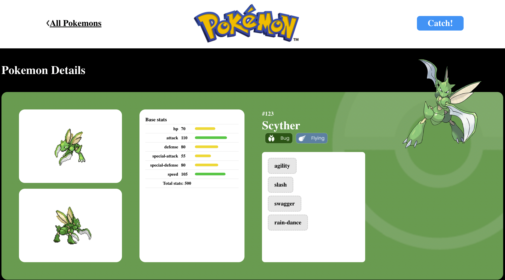

### **On this project were used the concepts of:**

### _React, React Router, Styled-components, React Context, Axios, API, Design Systems._

 

Users have a list of Pokémon displayed for them to try to catch, and once they have caught a Pokémon, they can see it on their Pokédex page.

The Pokémon card show some pokémon's details, also the details and catch option.

  

Pokémon cards has some interactive actions triggered by user, they are:

> Catch chance: Users will not have a 100% chance to catch a Pokémon. There is a chance that their Pokéball may break.
>  
> Shiny chance: Users can encounter a shiny version of a Pokémon. There is a chance to find them by using the catching system.
>  
> Release button: Users can release their Pokémon, removing it from their Pokédex page (if it's been caught).

  

 
 

### On the Pokédex page, users can see the Pokémon they have already caught and can access their details and the release button as well.

  

 
 

### Inside pokémon Details use can see some extra informations about this pokémon, also they can try to catch or release.

    

### When user releases a pokémon, it will no long be displayed on their Pokedex, so user can try to catch it again from the list.

  

 
 

###

### This project was made for study proposals for a Full Stack Web Development course given by the company Labenu.
